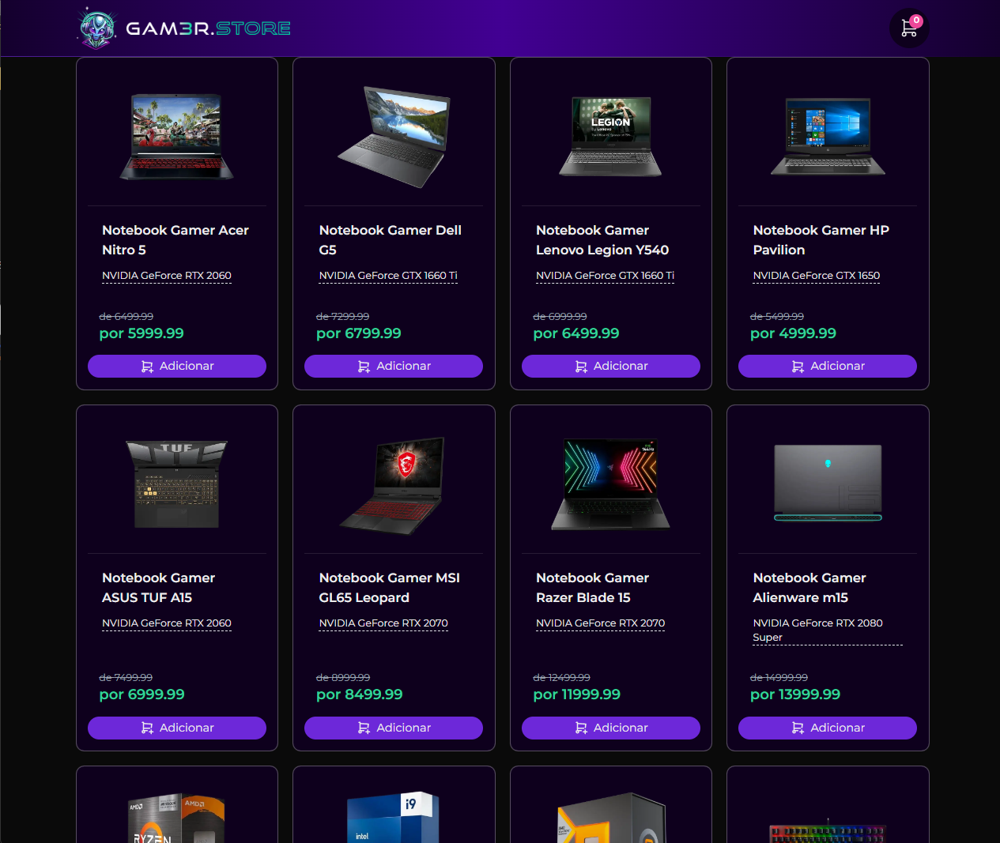
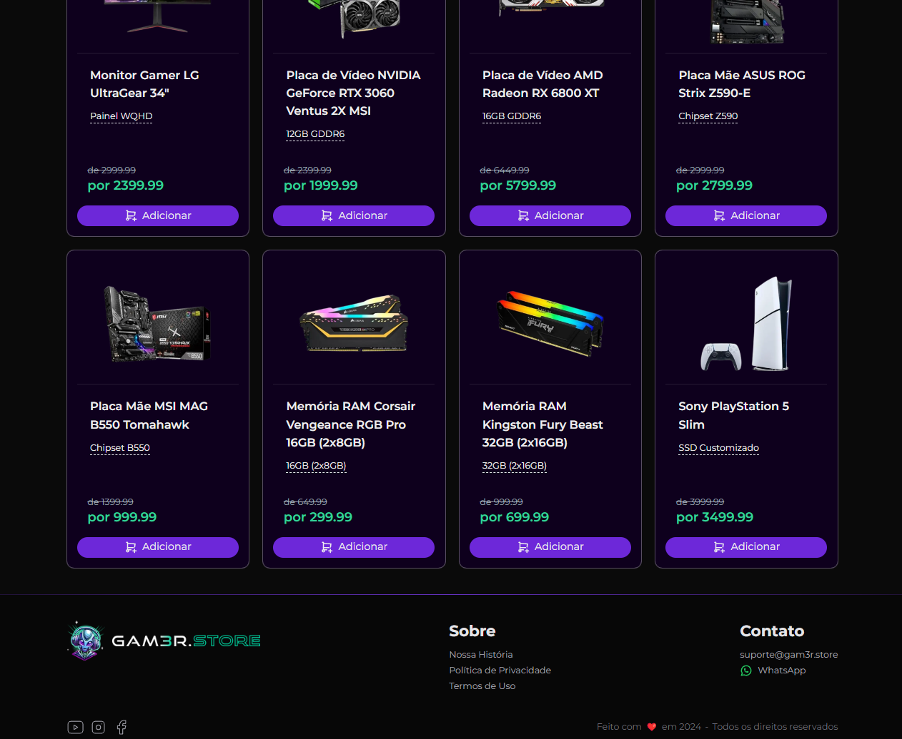
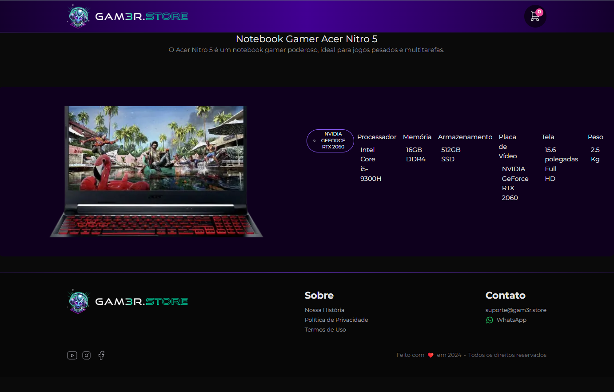

# Gam3r.store 

## Evento promovido pela CODER  (https://www.cod3r.com.br/)


# Tecnologias utilizadas desse projeto  
```
Nest.js
Tailwind.css
Prisma
Next.js

```
# Home do projeto 





# requisitos mínimos do projeto  
```
Para rodar o projeto você precisa ter o node.js ,um editor de texto 

1-Primeiro clone o projeto 
2-Utilize sua IDE  vá ao terminal acesse a pasta backend e rode o comando npm run start 
3-Abra um segundo terminal acesse a pasta front-end e rode o comando npm run dev
4-Faça alterações de acordo com suas regras de negócios lembrando que aqui temos apenas o front-end e um backend com regras de negocio genérico !
```


